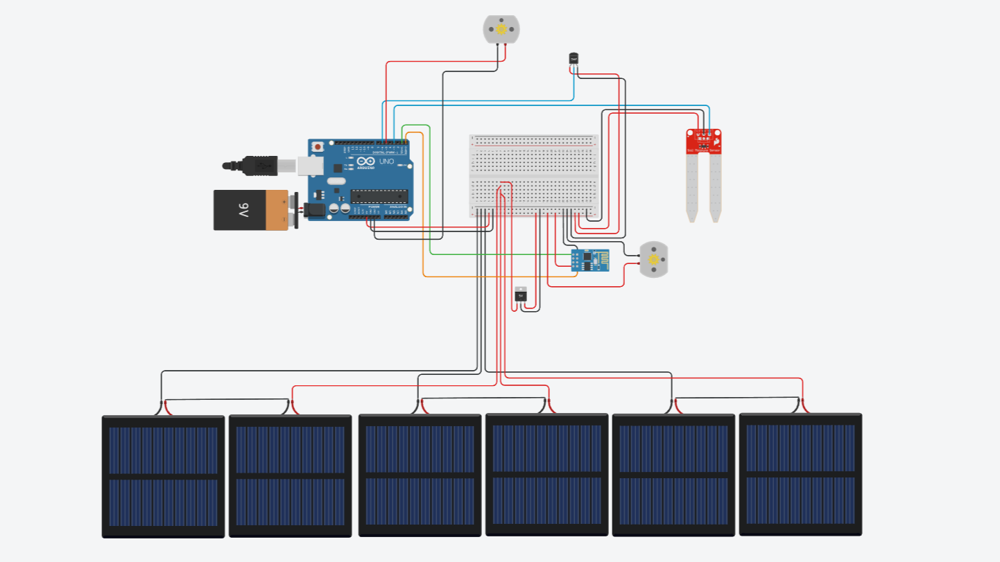
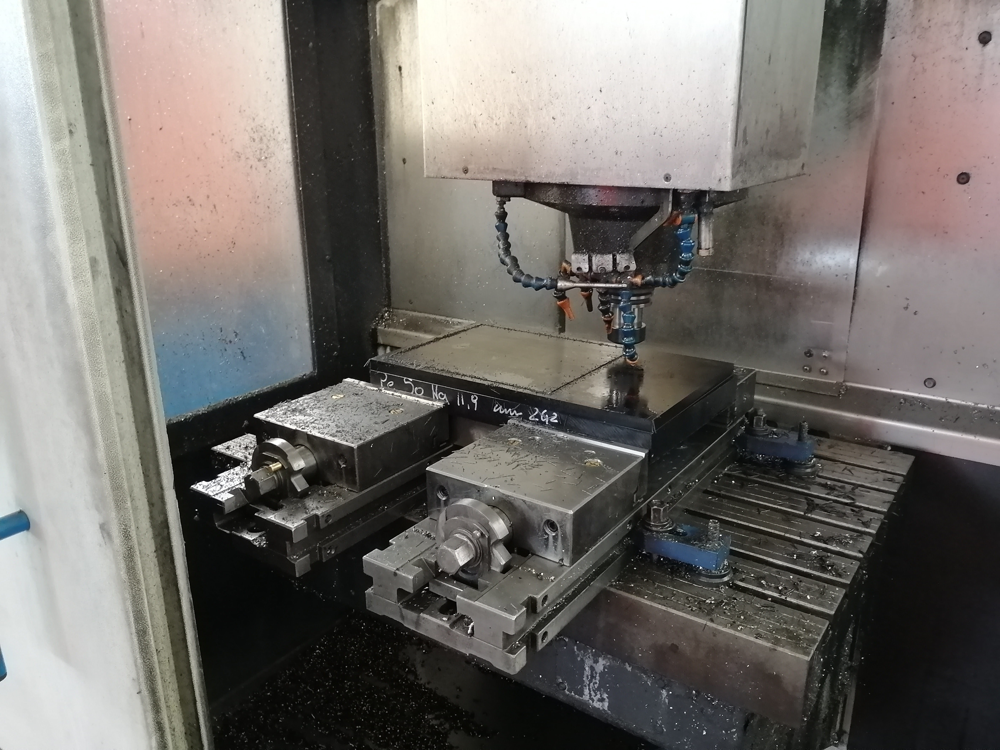
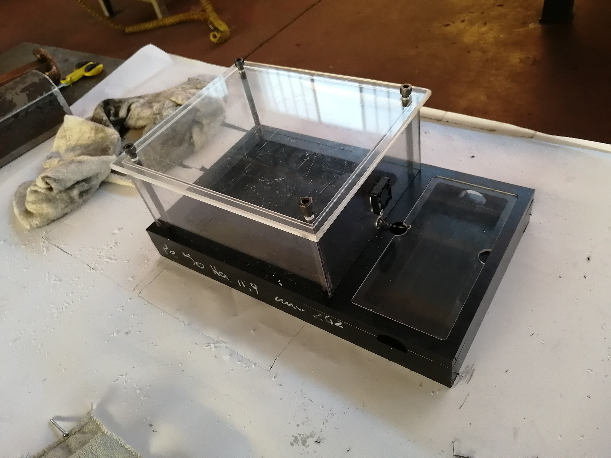
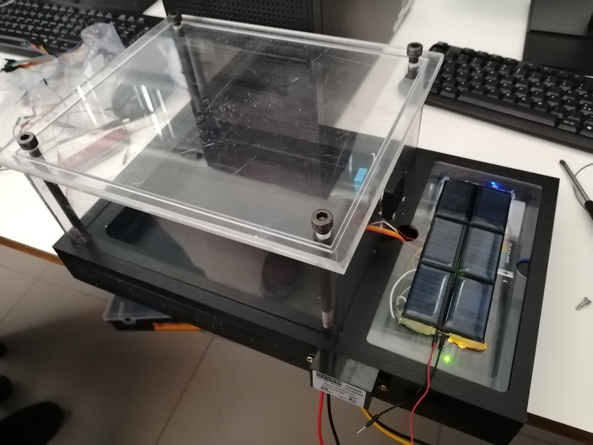
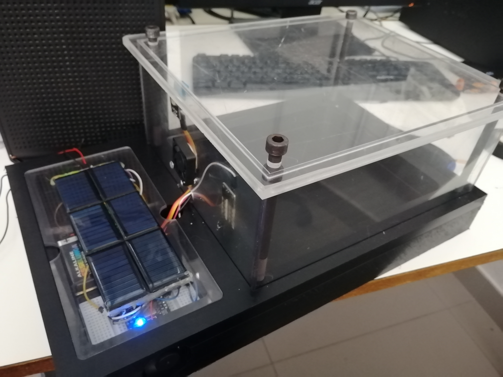
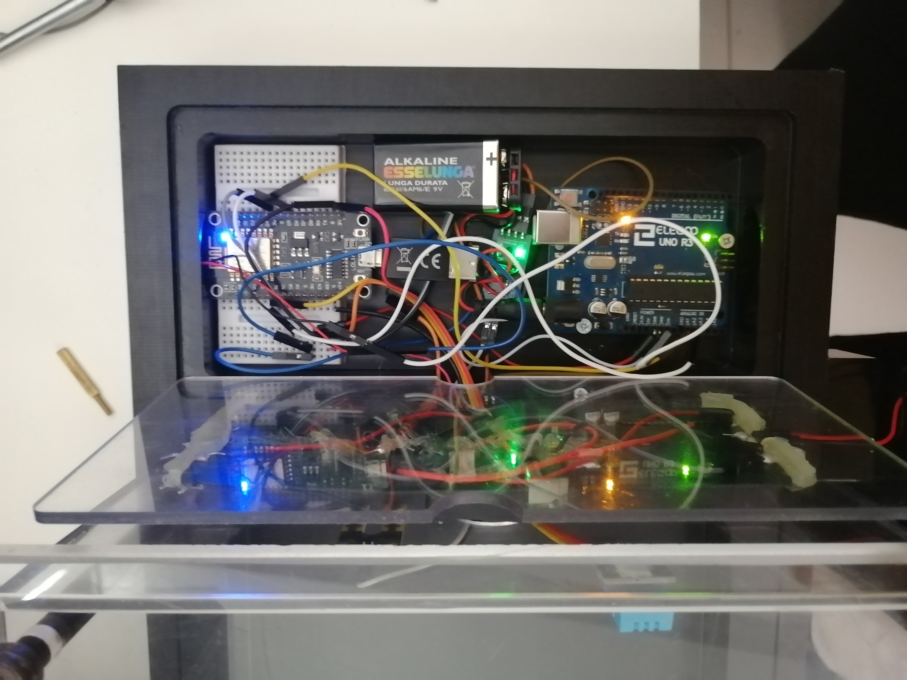

# Capolavoro 2023/2024

# Indice
1. [Schema](#Schema)
2. [Codice](#Codice)
3. [Realizzazione](#Realizzazione)
4. [Montaggio](#Montaggio)


   
# Schema



# Codice

### aurduinoR1.ino
```

#include <DHT.h>

#define DHTPIN A1 // analog pin A1
#define MOISTURE_SENSOR_PIN A0
#define DHTTYPE DHT11

// DHT11: DATA-5V-GND FRONT-VIEW
DHT dht(DHTPIN, DHTTYPE);

void setup() {
  Serial.begin(9600);
  delay(1000); 
  Serial.println("Avvio sistema");
  dht.begin();
}

void loop() {
  delay(1500);
  int sensorValue = analogRead(MOISTURE_SENSOR_PIN);
  float moidtureHumidity = map(sensorValue, 0, 1023, 0, 100);
  float humidity = dht.readHumidity();
  float temperature = dht.readTemperature();

  if (isnan(humidity) || isnan(temperature)) {
    Serial.println("Failed to read from DHT sensor!");
    return;
  }

  if (temperature > 20) {
    digitalWrite(5, HIGH);
  }

  Serial.print("Humidity: ");
  Serial.print(humidity);
  Serial.print(" %\t");
  Serial.print("Temperature: ");
  Serial.print(temperature);
  Serial.println(" *C");
  Serial.print("Soil Humidity: ");
  Serial.print(moidtureHumidity);
  Serial.println(" %");

  // Send temperature and humidity to ESP8266
  Serial.print("T:");
  Serial.print(temperature);
  Serial.print(",H:");
  Serial.println(humidity);
}

```


### esp8266.ino

```

/*

    Esempi usati:
        ESP8266 -> WifiClient
        ESP8266HTTPClient -> PostHttpClient

*/

#include <ESP8266WiFi.h>


#ifndef STASSID
#define STASSID "#########"
#define STAPSK "#########"
#endif

const char* ssid = STASSID;
const char* password = STAPSK;

// Server 
const char* host = "135.125.132.97";
const uint16_t port = 5000;


const int analogPin = A0;  

void setup() {
  Serial.begin(115200);

  
  Serial.println();
  Serial.println();
  Serial.print("Connecting to ");
  Serial.println(ssid);

  WiFi.mode(WIFI_STA);
  WiFi.begin(ssid, password);

  while (WiFi.status() != WL_CONNECTED) {
    delay(500);
    Serial.print(".");
  }

  Serial.println("");
  Serial.println("WiFi connected");
}

void loop() {
  
  int analogValue = analogRead(analogPin);

  String data = "value=" + String(analogValue);

  Serial.print("Connecting to ");
  Serial.print(host);
  Serial.print(':');
  Serial.println(port);

  WiFiClient client;
  if (!client.connect(host, port)) {
    Serial.println("Connection failed");
    delay(10000); 
    return;
  }

  Serial.println("Sending data to server");
  if (client.connected()) {
    client.print("GET /update?");
    client.print(data);
    client.println(" HTTP/1.1");
    client.print("Host: ");
    client.println(host);
    client.println("Connection: close");
    client.println();
  }

  unsigned long timeout = millis();
  while (client.available() == 0) {
    if (millis() - timeout > 5000) {
      Serial.println(">>> Client Timeout !");
      client.stop();
      delay(10000); 
      return;
    }
  }

  Serial.println("Receiving from remote server");
  while (client.available()) {
    char ch = static_cast<char>(client.read());
    Serial.print(ch);
  }


  Serial.println();
  Serial.println("Closing connection");
  client.stop();

  delay(10000);  
}

```

# Realizzazione
### Per il processo di realizzazione del pezzo mi sono rivolto all'azienda [Alberici Stampi](https://www.albericistampi.it)




# Montaggio
### Per il processo di montaggio si è cercato di seguire lo [schema elettrico](#Schema)






### Per stabilizzare la tensione fornita dai pannelli solari a 5v è stato necessario l'utilizzo di uno stabilizzatore di tensione posizionato sul lato del pezzo, il tutto al fine di non danneggiare i sensori e componenti.
### Il codice per entrambi i micro-controllori è stato caricato singolarmente per poi alimentare il tutto con una pila 9v


[vai all'indice](#Indice)